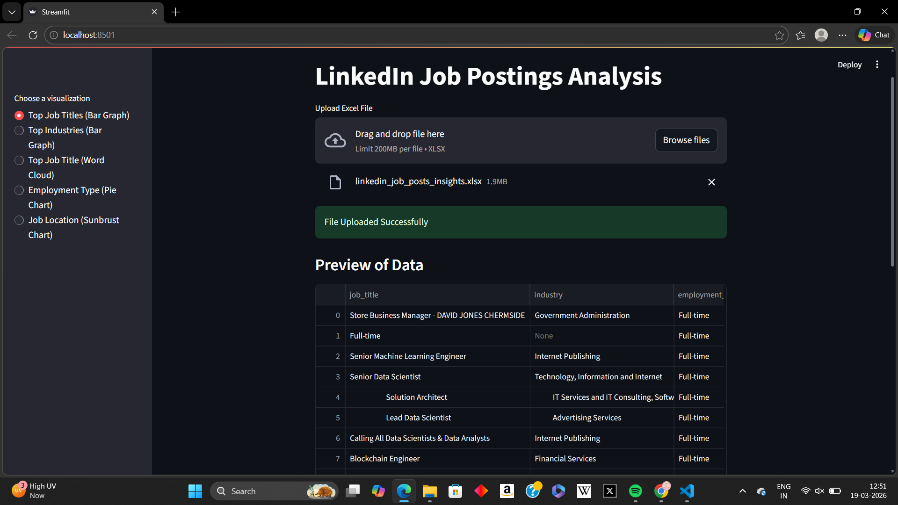
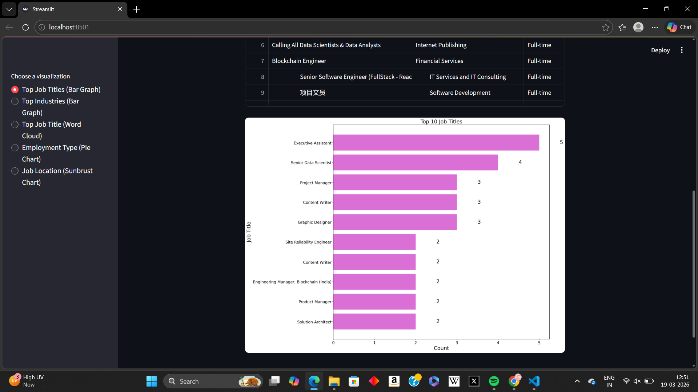

# LinkedIn Job Postings Analysis (Python + Streamlit)

## 📌 Project Overview
This project analyzes LinkedIn job posting data using Python and presents interactive visualizations through a Streamlit web application.  
The application allows users to upload job posting datasets and explore hiring trends, job roles, industries, and employment types through dynamic charts.

---

## 🚀 Features
- Upload Excel dataset dynamically
- Top Job Titles analysis (Bar Graph)
- Industry-wise hiring trends
- Word Cloud visualization of job roles
- Employment Type distribution (Pie Chart)
- Job Location analysis (Sunburst Chart)
- Interactive and user-friendly interface

---

## 🛠 Tech Stack
- Python
- Streamlit
- Pandas
- Matplotlib
- Plotly
- WordCloud
- OpenPyXL

---

## 📂 Project Structure

Linkedin_job_posting_analysis
│
├── app.py
├── requirements.txt
├── dataset.xlsx
├── dashboard_preview.png
└── chart_visualization.png

---

## 📷 Application Preview

### Main Interface

### Visualization Example

---

## ▶️ How to Run Locally

### 1️⃣ Clone Repository
git clone https://github.com/Chhayangi/Linkedin_job_posting_analysis.git

Install Dependencies
pip install -r requirements.txt

Run Streamlit App
streamlit run app.py

---

##Author

**Chhayangi Nishad**
Aspiring Data Analyst | Python | Data Visualization | Streamlit

---

⭐ ##If you like this project, 
feel free to ⭐ the repository!

